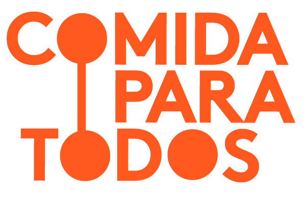
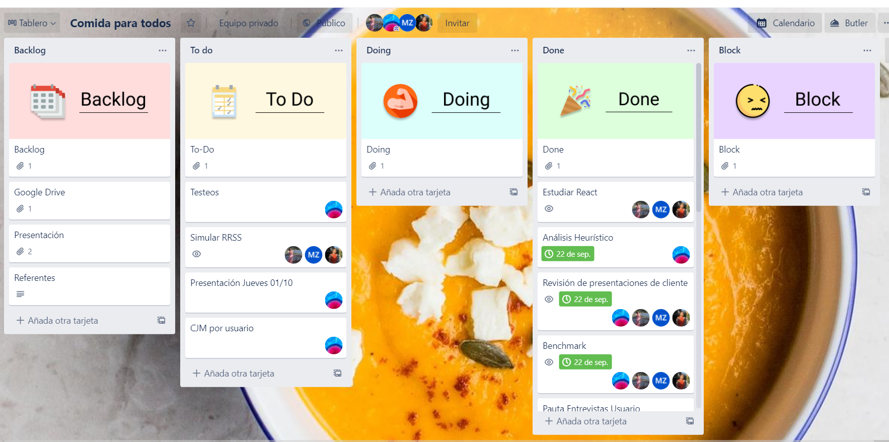
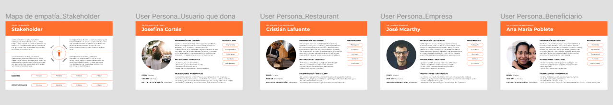
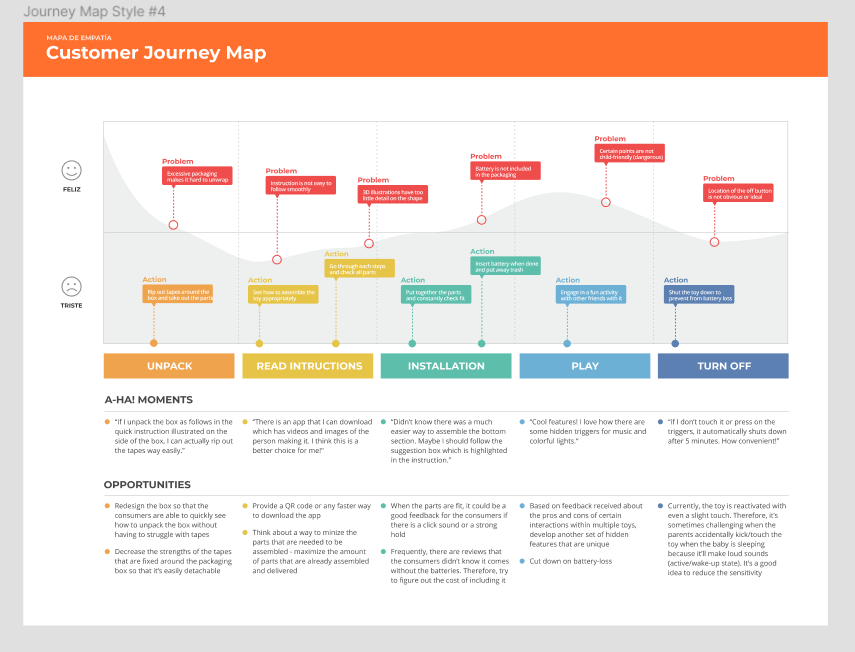

##### [Link para pagina web ](https://comidaparatodosreactivas.web.app)

## **Índice**

- [1. Resumen del proyecto](#1-resumen-del-proyecto)
- [2. Resumen del producto](#2-resumen-del-producto)
- [3. Planificación](#3-planificacion)
- [4. Proceso UX/ UI](#4-proceso-de-ux)
- [5. Feedback](#5-feedback)

### **1. Resumen del proyecto**

Desafio: Mejorias en una página ya existente, ayudando en la divulgación y mayor captación de donaciones para ayudar y apoyar personas que enfrentan un momento dificil, a través de la fundación **Comida para todos.**

### **2. Resumen del producto**

Desarrollado con React.js, con CSS puro, el proyecto tiene meta principal solucionar el dolor de la Fundación **Comida para Todos**, enfocandose en mostrar a los futuros donantes de forma transparente, el destino de las donaciones, maneras de hacer donaciones, historias de personas que recebieron ayuda.

Con la colaboración entre estudiantes de Ux y Front-End, mejoramos el design de la página web, dejandola más interesante y así obtenendo una mejor experiencia para el usuario.

### **3. Planificación**

Empezamos a planificar todo lo que seria necesario para el desarrollo de la página web utilizando el **Trello**, donde nos permitió una mejor visualización de todas las etapas necesarias, y dividimos las tareas por sprint.

### **4. Proceso UX/ UI**

Basado en ideas de las colaboradoras, creamos nuestro diagrama de flujo, hecho en papel y lapis.

Fueron hechas entrevistas, testeos con usuarios.
Definido el mapa de empatia:

####

####

#

##### Definición de usuario

Donantes en general de la fundación **Comida para Todos**.

#

#

##### Prototipos con Figma

##

Prototipo de alta fidelidad para desktop

[Link prototipo desktop](https://www.figma.com/proto/DyNzfaMkPStVtv5wF0CK8C/Comida-para-todos?node-id=290%3A0&scaling=min-zoom)

#

Prototipo de alta fidelidad para mobile
[Link prototipo mobile](https://www.figma.com/proto/DyNzfaMkPStVtv5wF0CK8C/Comida-para-todos?node-id=271%3A1872&scaling=scale-down)

### **5. Feedbacks**

De acuerdo con los feedbacks recibidos:

- mejorías en el código, optimizandolo con la librería React.

#

## Autor@s:

[Angelina Ziran](https://github.com/Angieziran?tab=repositories)

[Fabiane Santos](https://github.com/FabianeSantos?tab=repositories)

[Maritzu Zuñiga](https://github.com/maritz-u?tab=repositories)

[Sol Marina Parra Arrioja](https://github.com/SolMarina?tab=repositories)
